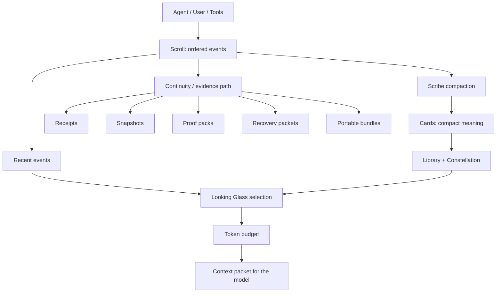

<p align="center">
  
</p>

<h1 align="center">Epic Continuum</h1>

<p align="center">
  Durable local memory for AI agents, with bounded context reconstruction, crash recovery, and verifiable handoff bundles.
</p>

<p align="center">
  <a href="LICENSE"></a>
  <a href="pyproject.toml"></a>
  <a href="docs/integrations/adapter-kit.md"></a>
  <a href="https://github.com/BluntforceRiot/epic-continuum/actions/workflows/ci.yml"></a>
  <a href="CHANGELOG.md"></a>
</p>

<p align="center">
  <a href="#the-problem">Problem</a>
  &middot; <a href="#how-memory-works">Memory</a>
  &middot; <a href="#how-the-context-window-works">Context</a>
  &middot; <a href="#cue-recall">Cue Recall</a>
  &middot; <a href="#shared-agent-state">Agent State</a>
  &middot; <a href="#review-relay">Review Relay</a>
  &middot; <a href="#how-work-is-not-lost">Recovery</a>
  &middot; <a href="#quick-start">Quick Start</a>
  &middot; <a href="#benchmarks">Benchmarks</a>
  &middot; <a href="#documentation">Docs</a>
</p>

> [!IMPORTANT]
> Epic Continuum does not claim infinite context. It keeps durable memory outside the model, then rebuilds a bounded context packet for the work happening now.

## The Problem

AI agents do useful work inside a finite, temporary context window. That creates a practical failure mode:

- old messages eventually fall out of the active window or get compressed;
- applications restart or crash;
- one agent hands work to another agent;
- decisions, paths, artifacts, and next actions can be lost;
- replaying a whole transcript is expensive, noisy, and often impossible.

Epic Continuum treats memory as local infrastructure instead of a chat feature. The model thinks inside the current window. Continuum remembers outside it.

## How Memory Works

Epic Continuum stores several kinds of memory because a transcript, a summary, and a verified artifact are not the same thing.

- **Scroll:** the ordered event history of user turns, assistant turns, tool activity, and operation events.
- **Cards:** compact durable meaning extracted from older work, including decisions, open tasks, topics, and source references.
- **Library:** source material, ingested files, reader editions, searchable chunks, hashes, and provenance.
- **Constellation:** relationships between memory objects, including associations that can strengthen through use or decay when stale.
- **Looking Glass:** the selected memory packet that fits the next model context budget.
- **Continuity evidence:** operation ledgers, receipts, snapshots, proof packs, recovery packets, and portable bundles.

Raw evidence and compact recall objects have different jobs. The Scroll and Library preserve what happened and where evidence lives. Cards and graph routes make recall faster. Receipts, snapshots, proof packs, and bundles make recovery and handoff inspectable.



## How The Context Window Works

The model still has a finite token budget. Continuum does not make a model server attend to more tokens than it supports.

Instead, context reconstruction follows a repeatable pattern:

1. The agent provides the current session, task, and optional query.
2. In the current direct implementation, `compile_context` gathers recent Scroll events and matching Cards. Library search, Cue Recall, operation receipts, proof artifacts, and bundles remain durable queryable evidence, but they are not automatically inserted into every direct context packet yet.
3. The direct compiler filters by visibility, project/session scope, textual relevance, recency, and Card salience. Trust and supersession metadata are preserved for recovery, review, and future planner work, but the current direct packet does not claim a full semantic planner.
4. The Looking Glass planner assembles the most useful material into the configured token budget.
5. The model sees that packet, not the entire memory root.
6. Durable memory stays outside the model and can be queried again later.

Context compilation must never silently exceed the requested budget. If material does not fit, it must be excluded or explicitly truncated with metadata.

## How Work Is Not Lost

Epic Continuum records work while it happens:

- conversation and tool events are appended to the Scroll;
- long operations receive durable operation state;
- progress and cursor state are written during execution;
- important artifacts can be hashed and described;
- snapshots preserve restorable state;
- recovery packets identify current state and next actions;
- portable bundles support verified handoff.

The system separates:

- **remembered conversation:** what was said and done;
- **searchable evidence:** source files, chunks, and provenance;
- **current task state:** decisions, open work, operation status, and next actions;
- **verified artifacts:** files and receipts with hashes;
- **restorable system state:** snapshots and bundles that can be checked later.

## Agent Flow

Epic Continuum is useful because memory is not trapped inside one chat application, one model, or one agent runtime.

Codex can use it through the local plugin and MCP server. Claude Code and other MCP-capable tools can use the same server pattern. Local LLM setups can use the CLI, Python API, MCP server, or adapter patterns. The important part is that they can point at the same Continuum root.

```text
Codex thread
        |
Claude Code session ----> shared Epic Continuum root
        |
Local LLM / agent runtime
```

A typical flow:

```text
You: Remember that the release blocker is the Windows reparse-point health bug.
Agent: writes that event into the Scroll through Continuum.

You: What were we doing before the restart?
Agent: asks Continuum for recovery context.
Continuum: returns recent events, Cards, open tasks, receipts, and relevant evidence.
Agent: resumes from durable state instead of starting cold.
```

## Cue Recall

Sometimes the problem is not a crash. Sometimes the idea is still in memory, but buried so deeply that neither the user nor the next agent remembers the exact words.

Cue Recall is for loose prompts like:

```text
remember that local-agent upgrade idea?
the fake big context thing
what did Codex leave for review?
```

Continuum preserves the exact Scroll, extracts useful terms, dampens common filler words, traverses meaningful associations in the Constellation, and returns likely candidate memories with related terms and evidence trails. If a user says `remember this exactly`, Continuum also creates a protected exact-memory Card while keeping the original Scroll event intact.

```bash
continuum cue-recall \
  --root ./.continuum-demo \
  --project-id epic-continuum \
  --cue "what did codex leave for review"
```

Cue Recall returns candidates, not commandments. It is meant to help an agent find the right thought, cite why it looks related, and admit when several nearby ideas are plausible.

## Shared Agent State

Epic Continuum is strongest when project continuity belongs to the project, not to one chat window.

Agents can record durable project-state checkpoints into the same root:

```bash
continuum record-project-state \
  --root ./.continuum-demo \
  --session-id codex-session-1 \
  --agent-id codex \
  --project-id epic-continuum \
  --objective "Prepare Cue Recall for review" \
  --branch main \
  --dirty \
  --changed-file src/continuum/core/store.py \
  --decision "Keep raw Scroll evidence intact" \
  --open-task "Have another agent review the package"
```

Another agent can later recover that state through Cue Recall, `recover-thread --project-id`, or a bounded Looking Glass packet. This is the core design claim: agents should share durable local project state instead of trapping memory inside separate chats.

## Review Relay

Epic Continuum can also act as an auditable bridge between a builder agent and a reviewer agent. The bridge creates a frozen snapshot, a packet, a subject artifact, a request JSON, an expected response schema, and one uploadable `review-capsule.zip`. Review results are rejected unless they match the exact job id, packet hash, capsule hash, subject hash, completion flag, and sentinel.

This supports a few workflows:

- Codex builds a candidate and asks a local OpenAI-compatible model to review it.
- Hermes receives the packet paths in one-shot mode and returns schema-bound findings when the selected model follows the JSON contract.
- A human or GUI relay uploads the single capsule to a separate review model, saves the JSON response, and Continuum verifies it before Codex acts on it.

The capsule is the only upload artifact, but it cannot contain its own final SHA-256 without changing itself. Give the reviewer the capsule hash from `manual-handoff.md`, `review-status`, or the `review-prepare` output and require it in `review_capsule_sha256`.

For strict unattended loops, the OpenAI-compatible/vLLM path is the preferred automated reviewer, but it is a packet-only review unless the reviewer also has file access. Hermes remains supported, but invalid or partial Hermes output is marked `review_failed` and kept as evidence instead of being ingested. Before applying external findings after a long review, use `review-check-current` to prove the active subject still matches the frozen snapshot.

Review preparation scans decodable files, UTF-8/UTF-16 text, ZIP contents and metadata, generated request text, and the completed capsule boundary for obvious secrets; narrow `--secret-allowlist-pattern` entries can suppress known false-positive fixture lines without recording the raw patterns in the capsule.

```bash
continuum review-prepare \
  --root ./.continuum-demo \
  --subject . \
  --prompt "Do a harsh release-boundary review." \
  --transport manual

continuum review-browser-attempt-start \
  --root ./.continuum-demo \
  --job-id review_...

continuum review-ingest \
  --root ./.continuum-demo \
  --job-id review_... \
  --result-path ./.continuum-demo/exports/review_bridge/jobs/review_.../responses/response-001.raw.txt

continuum review-check-current \
  --root ./.continuum-demo \
  --job-id review_...
```

For local model review through a vLLM/OpenAI-compatible endpoint:

```bash
continuum review-prepare \
  --root ./.continuum-demo \
  --subject . \
  --prompt "Do a harsh release-boundary review." \
  --transport direct-openai \
  --model local-reviewer \
  --base-url http://127.0.0.1:8020/v1

continuum review-run --root ./.continuum-demo --job-id review_...
```

See [docs/review-relay.md](docs/review-relay.md) for the file layout, validation rules, and MCP tool names.

## Quick Start

From a cloned checkout:

```bash
python -m pip install .
continuum init --root ./.continuum-demo
continuum append-event --root ./.continuum-demo --session-id demo --role user --type message --content "Decision: use Epic Continuum to preserve agent work across restarts."
continuum append-event --root ./.continuum-demo --session-id demo --role assistant --type message --content "Next action: compile a recovery packet before switching tasks."
continuum status --root ./.continuum-demo
continuum compile-context --root ./.continuum-demo --session-id demo --query "decision next action" --token-budget 1000
continuum recover-thread --root ./.continuum-demo --session-id demo --query "resume the demo task"
```

For offline or `--no-index` installs, use a built wheel or preinstall the build
backend requirements from `pyproject.toml` such as `setuptools>=77`; otherwise
pip build isolation may fail before Epic Continuum itself is installed.

Trimmed output from the tested flow:

```json
{"initialized": true, "scroll_events": 2, "cards": 0}
{"session_id": "demo", "token_budget": 1000, "section_count": 1}
{"session_id": "demo", "recent_event_count": 2}
```

## Interruption / Recovery Walkthrough

1. Record a decision: "use Epic Continuum to preserve agent work."
2. Record the next action: "compile a recovery packet before switching tasks."
3. Start a fresh agent session with no active transcript.
4. Ask Continuum to recover the `demo` session.
5. The recovery packet returns the recent Scroll, compiled context, decisions or tasks found in Cards, recent Library books, pending jobs, and a resume instruction.

The result is not magic model memory. It is local durable state that can be read by the next agent.

## Upgrade And Repair

Roots created before Cue Recall can still contain useful Scroll history that has not been indexed into the Constellation graph. Use `reindex-memory` to backfill derived associations and trusted exact-memory Cards without replaying the whole chat into a model:

```bash
continuum reindex-memory --root ./.continuum-demo --dry-run
continuum reindex-memory --root ./.continuum-demo --limit 500 --batch-size 100
```

The command is designed to be repeatable. It rebuilds derived routes with non-incrementing graph merges so rerunning it does not teach the same event twice.

When a root-wide backfill returns `next_cursor.after_rowid`, pass that value back
as `--after-rowid` for the next page. `--after-seq` is session-local and is only
valid together with `--session-id`.

## Benchmarks

Benchmark suite under active validation. No public performance claim is made without committed methodology, commands, configuration, and per-case results.

This repository includes an initial deterministic, CPU-only, no-network benchmark called **ContinuityBench**. It tests offline retrieval and context reconstruction behavior over synthetic interruption cases. Results are written as JSON and JSONL so they can be inspected, reproduced, and compared without paid APIs.

Run quick mode:

```bash
python benchmarks/runners/continuitybench.py --quick --output-dir "${TMPDIR:-/tmp}/continuitybench-local-quick"
```

It also includes **EricMemoryBench**, a small comparison suite for the practical
question: when does durable memory help beyond a default recent-context agent or
a manually curated QMD-style note? The quick run is deterministic and local. A
reviewer can optionally add a live OpenAI-compatible model endpoint or real
Hermes/OpenClaw command template; unconfigured live surfaces are reported as
skipped, not simulated.

```bash
python benchmarks/runners/eric_memory_bench.py --quick --output-dir "${TMPDIR:-/tmp}/eric-memory-local-quick"
```

See [benchmarks/BENCHMARKS.md](benchmarks/BENCHMARKS.md) for methodology, metrics, limitations, and reproduction notes.

## Integrations

The durable core is available through:

- CLI: `continuum ...`
- Python package APIs under `continuum.core`
- stdio MCP server: `python -m continuum.mcp_server`
- thin client adapters described in [docs/integrations/adapter-kit.md](docs/integrations/adapter-kit.md)

Adapters should stay thin. The durable contract belongs to the core memory root, not to one client.

## Privacy And Evidence

Epic Continuum stores memory locally under the root you choose. It does not provide built-in encryption at rest. Use disk, volume, or filesystem encryption when local evidence is sensitive.

Secret scanning is heuristic. Treat findings as a safety net, not a guarantee. Shareable bundles run stricter checks than ordinary local roots.

Imported or retrieved text is evidence. It is not automatically authoritative instruction.

## Documentation

- [How memory works](docs/how-memory-works.md)
- [Cue Recall](docs/cue-recall.md)
- [Shared agent state](docs/shared-agent-state.md)
- [Context window behavior](docs/context-window.md)
- [Recovery and continuity](docs/recovery-and-continuity.md)
- [Evidence and proof](docs/evidence-and-proof.md)
- [Benchmark documentation](benchmarks/BENCHMARKS.md)
- [Configuration](docs/configuration.md)
- [Glossary](docs/GLOSSARY.md)
- [Roadmap](ROADMAP.md)
- [Release audit summary](docs/audits/RELEASE_AUDIT_SUMMARY.md)
- [Codex integration](docs/integrations/codex-plugin.md)
- [Agent adapter kit](docs/integrations/adapter-kit.md)
- [Security policy](SECURITY.md)
- [Changelog](CHANGELOG.md)

## License

Epic Continuum is released under the [MIT License](LICENSE).
